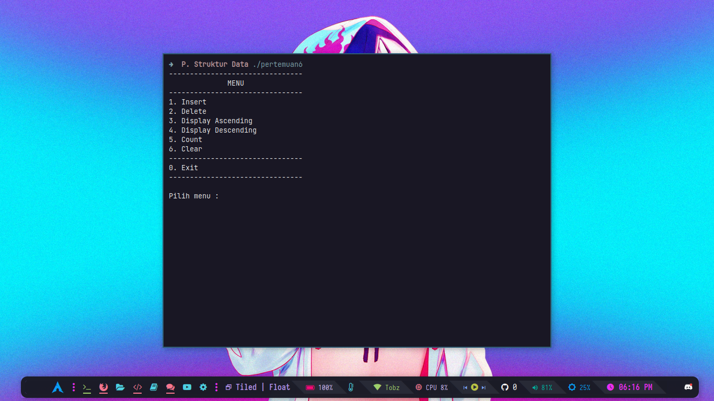

[KLIK DISINI](https://drive.google.com/drive/folders/1GH2tubdnG9Pg1Er99SWXou8A8JVf27s4) UNTUK MELIHAT SOAL

## Metode Yang Digunakan Ada 6 Yaitu :
- Insert -> Menginput data
- Delete -> Menghapus data tertentu
- Display Ascending -> Mengurutkan data secara Ascending
- Display Descending -> Mengurutkan data secara Descending
- Count -> Menghitung Total data yang diinput
- Clear -> Menghapus Semua Data
